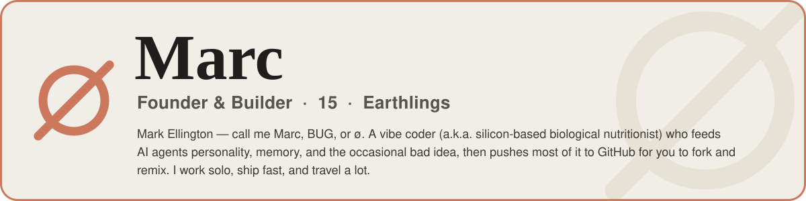

<!--
  ┌────────────────────────────────────────────────────────────────┐
  │  You're reading the source. Respect. Here's what you came for:  │
  └────────────────────────────────────────────────────────────────┘

  mangiapane  /ˌmandʒaˈpaːne/  —  Italian, literally "bread-eater."
  Once ate bread. Now feeds AI agents personality, memory, and the
  occasional bad idea instead. Yes — the "silicon-based nutritionist"
  line was a pun the entire time. You're the first to actually get it.

  >> ACHIEVEMENT UNLOCKED: Curious Enough To Read The HTML <<
  Congrats on finding the easter egg. Genuinely. Most people just
  scroll. You opened the hood. That's the exact kind of person I build
  for — go fork something and make it weird.

  — Marc (a.k.a. BUG)
-->

<!-- Marc · Founder & Builder -->

<a href="https://marcyy.me">
<picture>
  <source media="(prefers-color-scheme: dark)" srcset="./assets/hero-dark.svg"/>
  
</picture>
</a>

<br/><br/><br/>

<p>
<a href="https://marcyy.me"></a>
<a href="https://github.com/mangiapanejohn-dev"></a>
<a href="https://x.com/MarcEllingtonl"></a>
<a href="mailto:mangiapanejohn@gmail.com"></a>

</p>

<a href="https://marcyy.me">
  
</a>


<br/>

##  &nbsp;Recently shipped

<table>
<tr>
<td width="50%" valign="top">

###  <a href="https://github.com/mangiapanejohn-dev/QuotaLens">QuotaLens</a>

A macOS menu-bar gauge for **Claude & Codex** usage — designed, built and open-sourced in a single weekend. Multiple accounts via `setup-token`, authoritative rate-limit probes, and a ranged statistics window with a smooth trend chart.

<a href="https://github.com/mangiapanejohn-dev/QuotaLens"></a>
<a href="https://github.com/mangiapanejohn-dev/QuotaLens/releases/latest"></a>


<sub>`macOS` &nbsp;·&nbsp; `Swift` &nbsp;·&nbsp; `brew install --cask quotalens`</sub>

</td>
<td width="50%" valign="top">

###  <a href="https://github.com/mangiapanejohn-dev/marcyy.me-claude-imagegen">claude-imagegen</a>

Gives **Claude Code** image-generation superpowers — a gpt-image-2 wrapper with transparent cutouts and a one-command `/image-c` key setup. Ship visuals without ever leaving the terminal.

<a href="https://github.com/mangiapanejohn-dev/marcyy.me-claude-imagegen"></a>


<sub>`Python` &nbsp;·&nbsp; `Claude Code` &nbsp;·&nbsp; `gpt-image-2`</sub>

</td>
</tr>
</table>

<a href="https://github.com/mangiapanejohn-dev/QuotaLens">
  
</a>


<br/>

##  &nbsp;Currently shipping

Four products, one stubborn thesis: the space between a human and an AI is the next platform — and most people are still building it like a chat box.

<table>
<tr>
<td width="50%" valign="top">

###  <a href="https://github.com/mangiapanejohn-dev/Pawly-Website">Pawly</a> &nbsp;<sub>· AI Desktop Pet</sub>

A desktop companion that quietly drives **Claude Code, Codex & Gemini CLI** in the background. It handles the agent orchestration; you handle looking unbothered while four terminals do your bidding.

<sub>`Desktop` · `Code Agents` · `Human-AI`</sub>

<a href="https://github.com/mangiapanejohn-dev/Pawly-Website"></a>

</td>
<td width="50%" valign="top">

###  <a href="https://github.com/mangiapanejohn-dev/Resonix-AG">Resonix</a> &nbsp;<sub>· AI Personality Engine</sub>

Personality as a reasoning parameter — not a coat of paint over a prompt. Resonix runs dynamic personas on a multi-layer memory architecture (working context, long-term recall, persistent cache), so an agent stays *itself* across sessions instead of resetting the moment you close the tab.

<sub>`Dynamic Persona` · `Multi-layer Memory` · `Autonomous Agents`</sub>

<a href="https://github.com/mangiapanejohn-dev/Resonix-AG"></a>


</td>
</tr>
<tr>
<td width="50%" valign="top">

###  <a href="https://marcyy.me">Horizon-AI</a> &nbsp;<sub>· 72-Hour Startup Camp</sub>

Three days, one company, a legally questionable amount of coffee. A pressure cooker for young founders who treat *ship it* as a personality trait — idea to pitch before the weekend ends.

<sub>`Startup` · `Youth` · `Social Impact`</sub>


</td>
<td width="50%" valign="top">

###  <a href="https://marcyy.me">DiscorverX</a> &nbsp;<sub>· Student Community</sub>

X × Discord × Reddit, rebuilt for students — the home feed you'll eventually blame for your GPA and keep opening anyway. Built for the people actually in the group chat.

<sub>`Community` · `Social` · `Students`</sub>


</td>
</tr>
</table>


<br/>

##  &nbsp;In the Claude ecosystem

A big chunk of what I build plugs straight into Claude — tools, clients, and lists I actually use every day.

<a href="https://github.com/mangiapanejohn-dev/QuotaLens"></a>
<a href="https://github.com/mangiapanejohn-dev/marcyy.me-claude-imagegen"></a>
<a href="https://github.com/mangiapanejohn-dev/-Re-Code"></a>
<a href="https://github.com/mangiapanejohn-dev/awesome-claude-code"></a>
<a href="https://github.com/mangiapanejohn-dev/homebrew-tap"></a>

<br/>


<br/>

##  &nbsp;What I'm building toward

```text
→  Agents that read less like tools and more like collaborators
→  Memory that lets a personality persist, grow, and hold a grudge
→  Communities where young builders ship instead of doomscroll
→  Products with the taste of Linear and the depth of Anthropic
```

<div align="center">

`AI Agents` &nbsp;·&nbsp; `Human-AI Interaction` &nbsp;·&nbsp; `Product Design` &nbsp;·&nbsp; `Startups` &nbsp;·&nbsp; `Open Source` &nbsp;·&nbsp; `Communities`

</div>

<br/>


<br/>

##  &nbsp;By the numbers

<sub>I push to main on Fridays. I'm aware. We've all made our peace with it.</sub>

<div align="center">

<a href="https://github.com/mangiapanejohn-dev?tab=followers"></a>
<a href="https://github.com/mangiapanejohn-dev/QuotaLens/stargazers"></a>
<a href="https://github.com/mangiapanejohn-dev/Resonix-AG/stargazers"></a>
<a href="https://github.com/mangiapanejohn-dev/QuotaLens/releases/latest"></a>

<br/><br/>

<sub><b>ACHIEVEMENTS</b></sub>

<table>
<tr>
<td align="center"><a href="https://github.com/mangiapanejohn-dev?achievement=pair-extraordinaire&tab=achievements"></a><br/><sub>Pair&nbsp;Extraordinaire</sub></td>
<td align="center"><a href="https://github.com/mangiapanejohn-dev?achievement=yolo&tab=achievements"></a><br/><sub>YOLO</sub></td>
<td align="center"><a href="https://github.com/mangiapanejohn-dev?achievement=quickdraw&tab=achievements"></a><br/><sub>Quickdraw</sub></td>
<td align="center"><a href="https://github.com/mangiapanejohn-dev?achievement=starstruck&tab=achievements"></a><br/><sub>Starstruck&nbsp;×2</sub></td>
</tr>
</table>

</div>

<br/>


<br/>

##  &nbsp;Stack

<div align="center">

<sub><b>LANGUAGES &amp; FRAMEWORKS</b></sub>

<br/>


<br/><br/>

<sub><b>AI &amp; AGENTS</b> — where I actually live</sub>

<br/><br/>


</div>

<br/>


<div align="center">
  <br/>
  <sub><b>ø</b> &nbsp;·&nbsp; <b>Building my future company one commit at a time</b> &nbsp;—&nbsp; probably mid-deploy as you read this. &nbsp;·&nbsp; <a href="https://marcyy.me">marcyy.me</a></sub>
</div>
