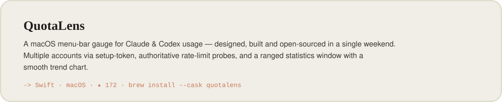
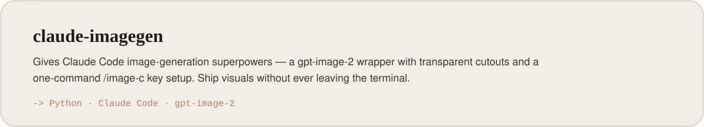
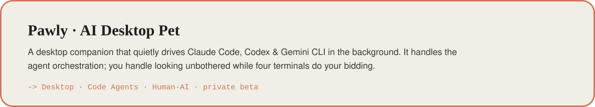
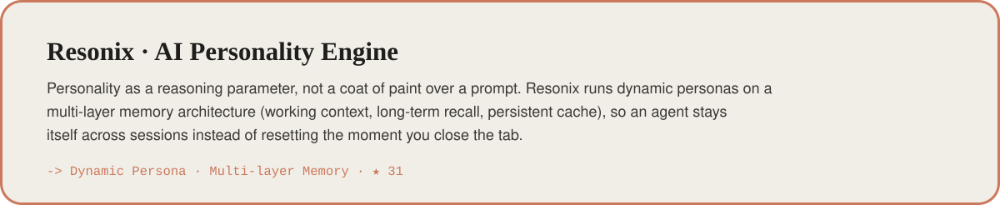
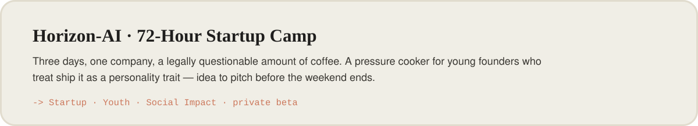
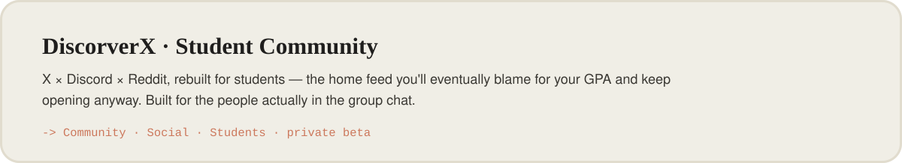

<!--
  ┌────────────────────────────────────────────────────────────────┐
  │  You're reading the source. Respect. Here's what you came for:  │
  └────────────────────────────────────────────────────────────────┘

  mangiapane  /ˌmandʒaˈpaːne/  —  Italian, literally "bread-eater."
  Once ate bread. Now feeds AI agents personality, memory, and the
  occasional bad idea instead. Yes — the "silicon-based nutritionist"
  line was a pun the entire time. You're the first to actually get it.

  >> ACHIEVEMENT UNLOCKED: Curious Enough To Read The HTML <<
  Congrats on finding the easter egg. Genuinely. Most people just
  scroll. You opened the hood. That's the exact kind of person I build
  for — go fork something and make it weird.

  — Marc (a.k.a. BUG)
-->

<!-- Marc · Founder & Builder -->

<a href="https://marcyy.me">
<picture>
  <source media="(prefers-color-scheme: dark)" srcset="./assets/hero-dark.svg"/>
  
</picture>
</a>

<br/><br/><br/>

<p>
<a href="https://marcyy.me"></a>
<a href="https://github.com/mangiapanejohn-dev"></a>
<a href="https://x.com/MarcEllingtonl"></a>
<a href="mailto:mangiapanejohn@gmail.com"></a>

</p>

<a href="https://marcyy.me">
  
</a>


<br/>

##  &nbsp;Recently shipped

<a href="https://github.com/mangiapanejohn-dev/QuotaLens">
<picture>
  <source media="(prefers-color-scheme: dark)" srcset="./assets/card-quotalens-dark.svg"/>
  
</picture>
</a>

<a href="https://github.com/mangiapanejohn-dev/marcyy.me-claude-imagegen">
<picture>
  <source media="(prefers-color-scheme: dark)" srcset="./assets/card-imagegen-dark.svg"/>
  
</picture>
</a>


<br/>

##  &nbsp;Currently shipping

Four products, one stubborn thesis: the space between a human and an AI is the next platform — and most people are still building it like a chat box.

<a href="https://github.com/mangiapanejohn-dev/Pawly-Website">
<picture>
  <source media="(prefers-color-scheme: dark)" srcset="./assets/card-pawly-dark.svg"/>
  
</picture>
</a>

<a href="https://github.com/mangiapanejohn-dev/Resonix-AG">
<picture>
  <source media="(prefers-color-scheme: dark)" srcset="./assets/card-resonix-dark.svg"/>
  
</picture>
</a>

<a href="https://marcyy.me">
<picture>
  <source media="(prefers-color-scheme: dark)" srcset="./assets/card-horizon-dark.svg"/>
  
</picture>
</a>

<a href="https://marcyy.me">
<picture>
  <source media="(prefers-color-scheme: dark)" srcset="./assets/card-discorverx-dark.svg"/>
  
</picture>
</a>


<br/>

##  &nbsp;In the Claude ecosystem

A big chunk of what I build plugs straight into Claude — tools, clients, and lists I actually use every day.

<a href="https://github.com/mangiapanejohn-dev/QuotaLens"></a>
<a href="https://github.com/mangiapanejohn-dev/marcyy.me-claude-imagegen"></a>
<a href="https://github.com/mangiapanejohn-dev/-Re-Code"></a>
<a href="https://github.com/mangiapanejohn-dev/awesome-claude-code"></a>
<a href="https://github.com/mangiapanejohn-dev/homebrew-tap"></a>

<br/>


<br/>

##  &nbsp;What I'm building toward

```text
→  Agents that read less like tools and more like collaborators
→  Memory that lets a personality persist, grow, and hold a grudge
→  Communities where young builders ship instead of doomscroll
→  Products with the taste of Linear and the depth of Anthropic
```

<div align="center">

`AI Agents` &nbsp;·&nbsp; `Human-AI Interaction` &nbsp;·&nbsp; `Product Design` &nbsp;·&nbsp; `Startups` &nbsp;·&nbsp; `Open Source` &nbsp;·&nbsp; `Communities`

</div>

<br/>


<br/>

##  &nbsp;By the numbers

<sub>I push to main on Fridays. I'm aware. We've all made our peace with it.</sub>

<div align="center">

<a href="https://github.com/mangiapanejohn-dev?tab=followers"></a>
<a href="https://github.com/mangiapanejohn-dev/QuotaLens/stargazers"></a>
<a href="https://github.com/mangiapanejohn-dev/Resonix-AG/stargazers"></a>
<a href="https://github.com/mangiapanejohn-dev/QuotaLens/releases/latest"></a>

<br/><br/>

<sub><b>ACHIEVEMENTS</b></sub>

<p align="center">
<a href="https://github.com/mangiapanejohn-dev?achievement=pair-extraordinaire&tab=achievements"></a>
&nbsp;&nbsp;&nbsp;
<a href="https://github.com/mangiapanejohn-dev?achievement=yolo&tab=achievements"></a>
&nbsp;&nbsp;&nbsp;
<a href="https://github.com/mangiapanejohn-dev?achievement=quickdraw&tab=achievements"></a>
&nbsp;&nbsp;&nbsp;
<a href="https://github.com/mangiapanejohn-dev?achievement=starstruck&tab=achievements"></a>
<br/><br/>
<sub>Pair&nbsp;Extraordinaire &nbsp;·&nbsp; YOLO &nbsp;·&nbsp; Quickdraw &nbsp;·&nbsp; Starstruck&nbsp;×2</sub>
</p>

</div>

<br/>


<br/>

##  &nbsp;Stack

<div align="center">

<sub><b>LANGUAGES &amp; FRAMEWORKS</b></sub>

<br/>


<br/><br/>

<sub><b>AI &amp; AGENTS</b> — where I actually live</sub>

<br/><br/>


</div>

<br/>


<div align="center">
  <br/>
  <sub><b>ø</b> &nbsp;·&nbsp; <b>Building my future company one commit at a time</b> &nbsp;—&nbsp; probably mid-deploy as you read this. &nbsp;·&nbsp; <a href="https://marcyy.me">marcyy.me</a></sub>
</div>
