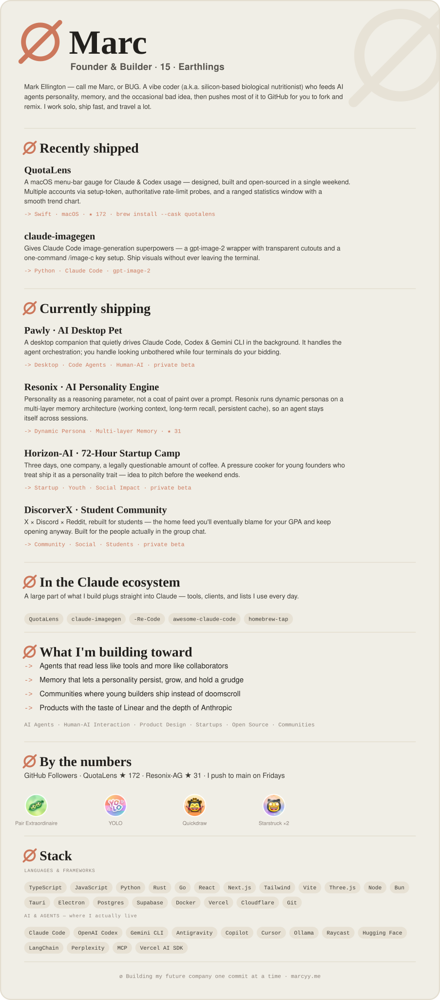

<!--
  ┌────────────────────────────────────────────────────────────────┐
  │  You're reading the source. Respect. Here's what you came for:  │
  └────────────────────────────────────────────────────────────────┘

  mangiapane  /ˌmandʒaˈpaːne/  —  Italian, literally "bread-eater."
  Once ate bread. Now feeds AI agents personality, memory, and the
  occasional bad idea instead. Yes — the "silicon-based nutritionist"
  line was a pun the entire time. You're the first to actually get it.

  >> ACHIEVEMENT UNLOCKED: Curious Enough To Read The HTML <<
  Congrats on finding the easter egg. Genuinely. Most people just
  scroll. You opened the hood. That's the exact kind of person I build
  for — go fork something and make it weird.

  — Marc (a.k.a. BUG / ø)
-->

<!-- ø · Marc · one continuous Claude canvas -->

<picture>
  <source media="(prefers-color-scheme: dark)" srcset="./assets/whole-dark.svg"/>
  
</picture>

