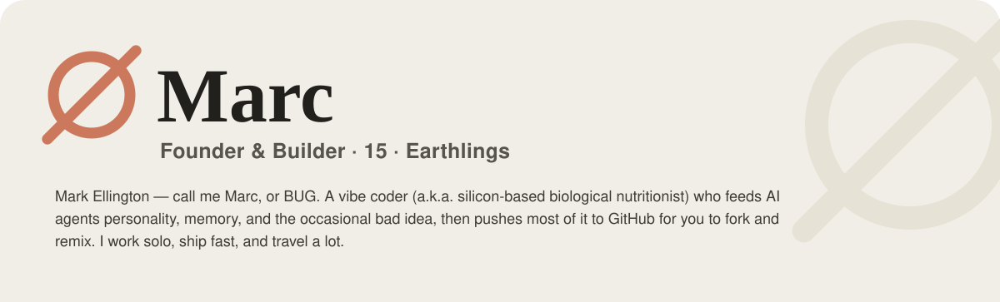
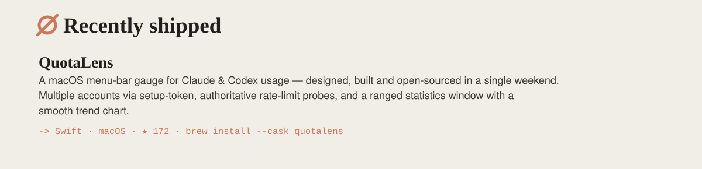
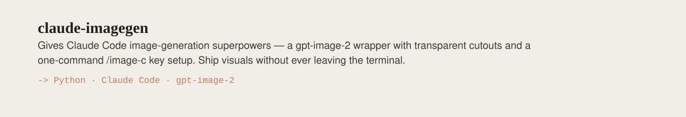
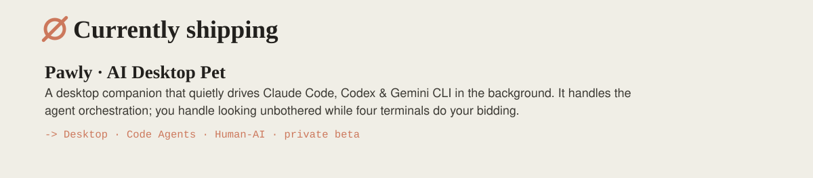
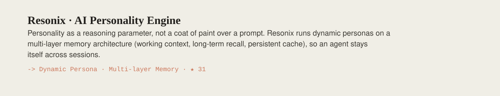
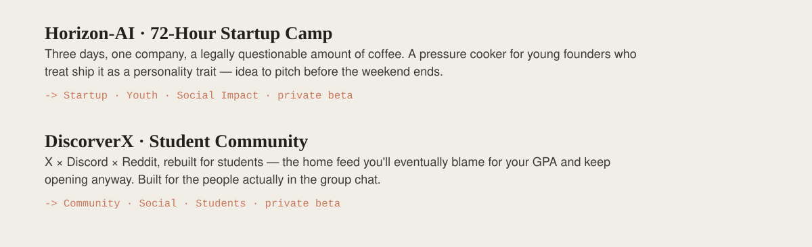
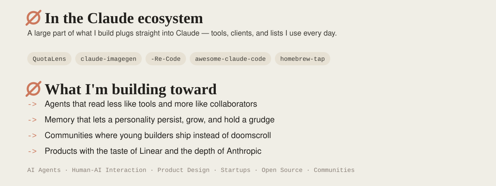
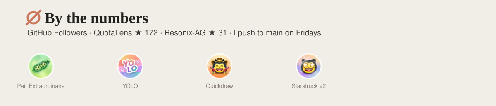
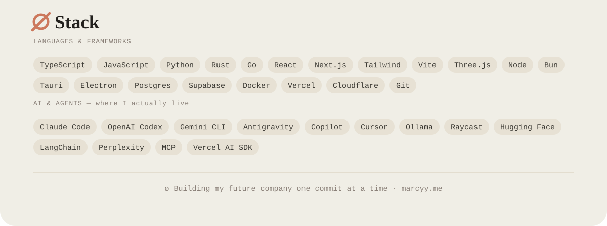

<!--
  ┌────────────────────────────────────────────────────────────────┐
  │  You're reading the source. Respect. Here's what you came for:  │
  └────────────────────────────────────────────────────────────────┘

  mangiapane  /ˌmandʒaˈpaːne/  —  Italian, literally "bread-eater."
  Once ate bread. Now feeds AI agents personality, memory, and the
  occasional bad idea instead. Yes — the "silicon-based nutritionist"
  line was a pun the entire time. You're the first to actually get it.

  >> ACHIEVEMENT UNLOCKED: Curious Enough To Read The HTML <<
  Congrats on finding the easter egg. Genuinely. Most people just
  scroll. You opened the hood. That's the exact kind of person I build
  for — go fork something and make it weird.

  — Marc (a.k.a. BUG / ø)
-->

<!-- ø · Marc — one continuous Claude canvas, sliced into clickable strips -->
<a href="https://marcyy.me"><picture><source media="(prefers-color-scheme: dark)" srcset="./assets/s-hero-dark.svg"/></picture></a>
<a href="https://github.com/mangiapanejohn-dev/QuotaLens"><picture><source media="(prefers-color-scheme: dark)" srcset="./assets/s-quotalens-dark.svg"/></picture></a>
<a href="https://github.com/mangiapanejohn-dev/marcyy.me-claude-imagegen"><picture><source media="(prefers-color-scheme: dark)" srcset="./assets/s-imagegen-dark.svg"/></picture></a>
<a href="https://github.com/mangiapanejohn-dev/Pawly-Website"><picture><source media="(prefers-color-scheme: dark)" srcset="./assets/s-pawly-dark.svg"/></picture></a>
<a href="https://github.com/mangiapanejohn-dev/Resonix-AG"><picture><source media="(prefers-color-scheme: dark)" srcset="./assets/s-resonix-dark.svg"/></picture></a>
<a href="https://marcyy.me"><picture><source media="(prefers-color-scheme: dark)" srcset="./assets/s-hordis-dark.svg"/></picture></a>
<a href="https://github.com/mangiapanejohn-dev?tab=repositories"><picture><source media="(prefers-color-scheme: dark)" srcset="./assets/s-ecobuild-dark.svg"/></picture></a>
<a href="https://github.com/mangiapanejohn-dev?tab=achievements"><picture><source media="(prefers-color-scheme: dark)" srcset="./assets/s-numbers-dark.svg"/></picture></a>
<a href="https://marcyy.me"><picture><source media="(prefers-color-scheme: dark)" srcset="./assets/s-stack-dark.svg"/></picture></a>
