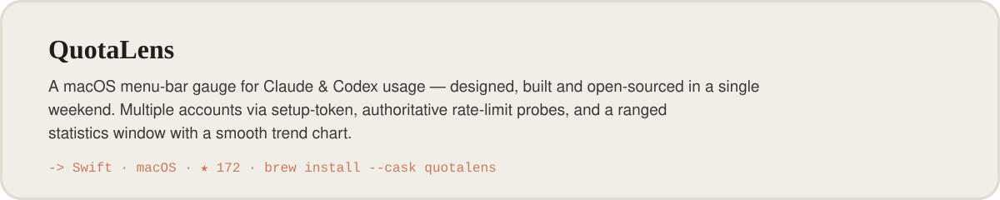
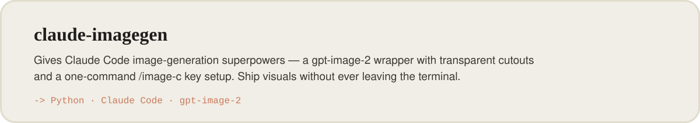
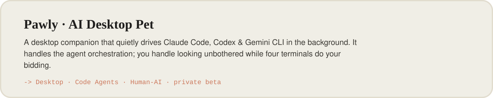
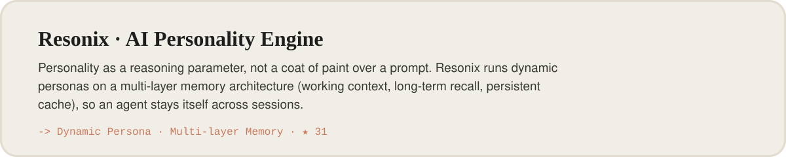
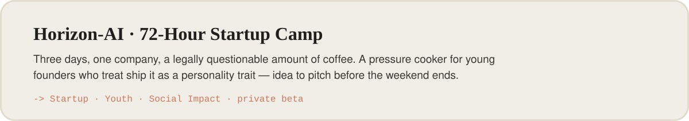
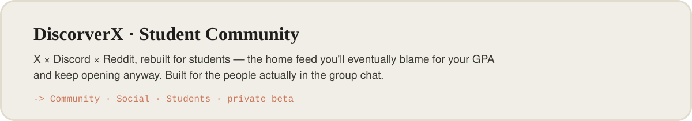
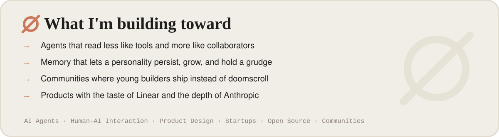

<!--
  ┌────────────────────────────────────────────────────────────────┐
  │  You're reading the source. Respect. Here's what you came for:  │
  └────────────────────────────────────────────────────────────────┘

  mangiapane  /ˌmandʒaˈpaːne/  —  Italian, literally "bread-eater."
  Once ate bread. Now feeds AI agents personality, memory, and the
  occasional bad idea instead. Yes — the "silicon-based nutritionist"
  line was a pun the entire time. You're the first to actually get it.

  >> ACHIEVEMENT UNLOCKED: Curious Enough To Read The HTML <<
  Congrats on finding the easter egg. Genuinely. Most people just
  scroll. You opened the hood. That's the exact kind of person I build
  for — go fork something and make it weird.

  — Marc (a.k.a. BUG / ø)
-->

<!-- ø · Marc · Founder & Builder -->

<a href="https://marcyy.me">
<picture>
  <source media="(prefers-color-scheme: dark)" srcset="./assets/hero-dark.svg"/>
  
</picture>
</a>

 

<picture>
  <source media="(prefers-color-scheme: dark)" srcset="./assets/band-recently-shipped-dark.svg"/>
  
</picture>

<a href="https://github.com/mangiapanejohn-dev/QuotaLens">
<picture>
  <source media="(prefers-color-scheme: dark)" srcset="./assets/proj-quotalens-dark.svg"/>
  
</picture>
</a>

<a href="https://github.com/mangiapanejohn-dev/marcyy.me-claude-imagegen">
<picture>
  <source media="(prefers-color-scheme: dark)" srcset="./assets/proj-imagegen-dark.svg"/>
  
</picture>
</a>

 

<picture>
  <source media="(prefers-color-scheme: dark)" srcset="./assets/band-currently-shipping-dark.svg"/>
  
</picture>

<a href="https://github.com/mangiapanejohn-dev/Pawly-Website">
<picture>
  <source media="(prefers-color-scheme: dark)" srcset="./assets/proj-pawly-dark.svg"/>
  
</picture>
</a>

<a href="https://github.com/mangiapanejohn-dev/Resonix-AG">
<picture>
  <source media="(prefers-color-scheme: dark)" srcset="./assets/proj-resonix-dark.svg"/>
  
</picture>
</a>

<picture>
  <source media="(prefers-color-scheme: dark)" srcset="./assets/proj-horizon-dark.svg"/>
  
</picture>

<picture>
  <source media="(prefers-color-scheme: dark)" srcset="./assets/proj-discorverx-dark.svg"/>
  
</picture>

 

<picture>
  <source media="(prefers-color-scheme: dark)" srcset="./assets/band-in-the-claude-ecosystem-dark.svg"/>
  
</picture>

 

<picture>
  <source media="(prefers-color-scheme: dark)" srcset="./assets/building-dark.svg"/>
  
</picture>

 

<picture>
  <source media="(prefers-color-scheme: dark)" srcset="./assets/band-by-the-numbers-dark.svg"/>
  
</picture>

&nbsp;&nbsp;

&nbsp;&nbsp;

&nbsp;&nbsp;

 

<picture>
  <source media="(prefers-color-scheme: dark)" srcset="./assets/band-stack-dark.svg"/>
  
</picture>

 

  <b>ø</b> &nbsp; Building my future company one commit at a time &nbsp;—&nbsp; probably mid-deploy as you read this. &nbsp;·&nbsp; <a href="https://marcyy.me">marcyy.me</a>

